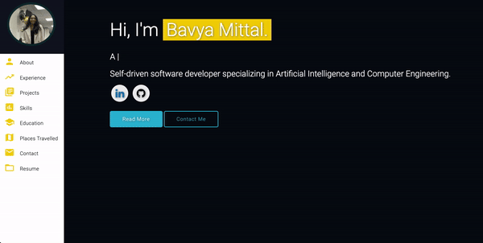
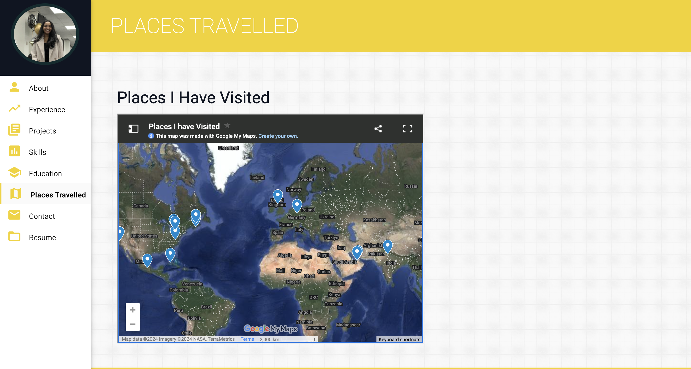
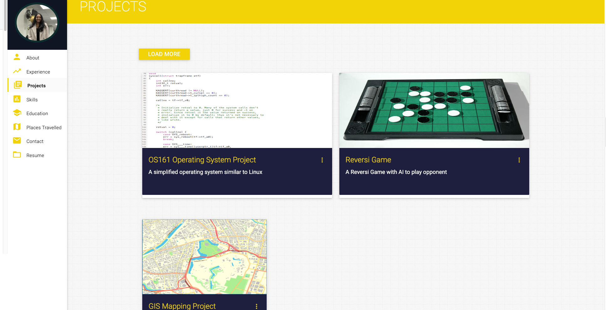

# Personal Portfolio ⚡️ 
> A clean, beautiful, responsive portfolio for Bavya Mittal
> https://bavyamittal.github.io

> This repo is a clone of https://varadbhogayata.github.io

### Website Preview

 
  <kbd>
    
  </kbd>

## Activity 1 📋
<a href="https://bavyamittal.github.io" target="_blank">

## Activity 2 📋
<a href="https://bavyamittal.github.io" target="_blank">
<a href="https://bavyamittal.github.io" target="_blank">

## Activity 3
<a href="https://bavyamittal.github.io" target="_blank">
<a href="https://bavyamittal.github.io" target="_blank">

⭐For this project, I tried to implement a more space theme and the colours chosen are to be consistent with this theme 

## Activity 4 
<a href="https://bavyamittal.github.io" target="_blank">
<a href="https://bavyamittal.github.io" target="_blank">

## Activity 5 
<a href="https://bavyamittal.github.io" target="_blank">
<a href="https://bavyamittal.github.io" target="_blank">

## Features 📋
⚡️ Fully Responsive\
⚡️ Valid HTML5 & CSS3\
⚡️ Typing animation using `Typed.js`\
⚡️ Easy to modify

## Sections 📚
✔️ About me\
✔️ Experience\
✔️ Projects \
✔️ Skills \
✔️ Education\
✔️ Contact Info\
✔️ Resume
