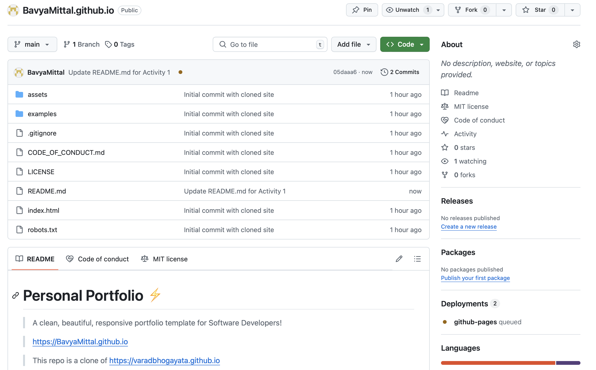
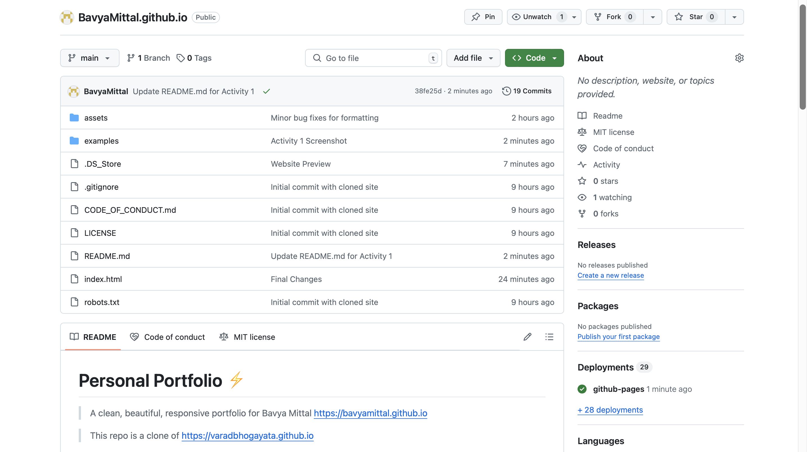
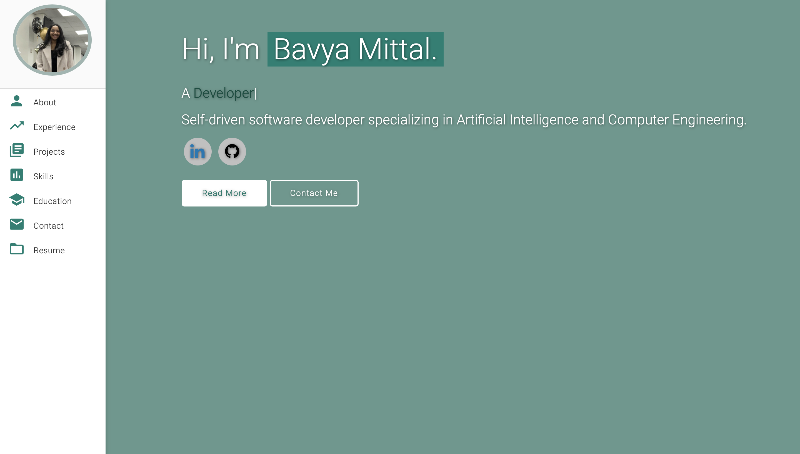
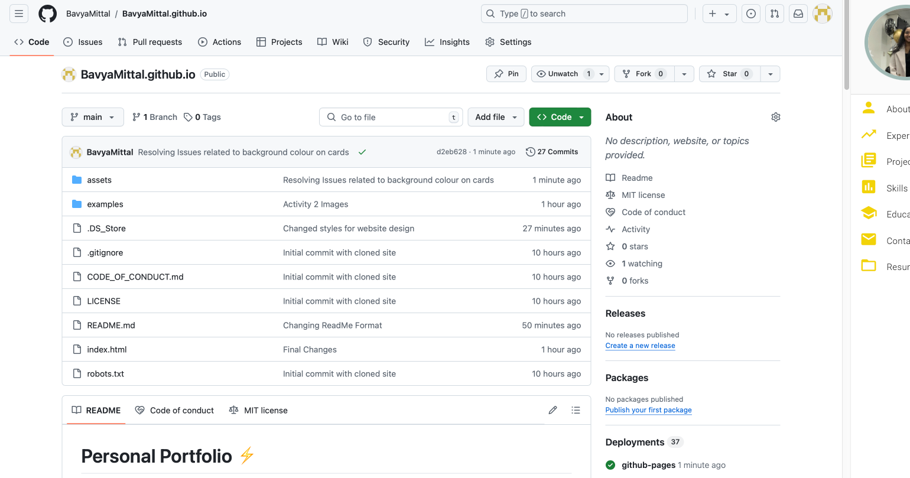
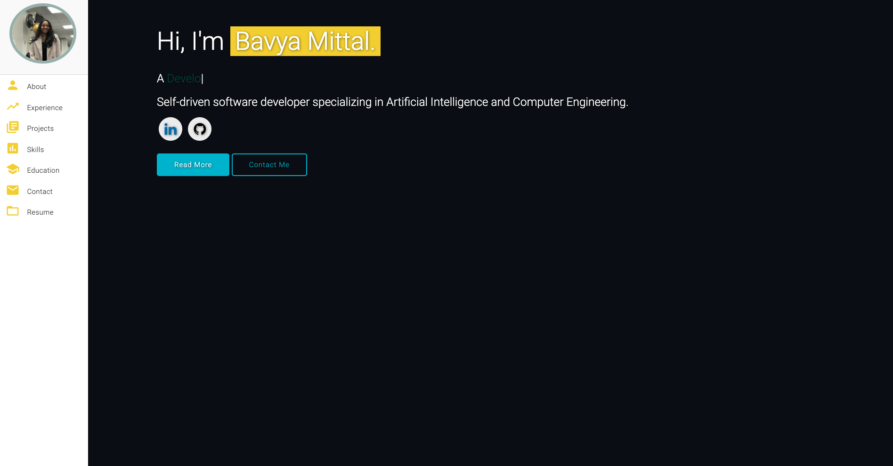

# Personal Portfolio ⚡️ 
> A clean, beautiful, responsive portfolio for Bavya Mittal
> https://bavyamittal.github.io

> This repo is a clone of https://varadbhogayata.github.io

### Website Preview

 
  <kbd>
    
  </kbd>

## Activity 1 📋
<a href="https://bavyamittal.github.io" target="_blank">

## Activity 2 📋
<a href="https://bavyamittal.github.io" target="_blank">
<a href="https://bavyamittal.github.io" target="_blank">

## Activity 3
<a href="https://bavyamittal.github.io" target="_blank">
<a href="https://bavyamittal.github.io" target="_blank">

⭐For this project, I tried to implement a more space theme and the colours chosen are to be consistent with this theme \

## Features 📋
⚡️ Fully Responsive\
⚡️ Valid HTML5 & CSS3\
⚡️ Typing animation using `Typed.js`\
⚡️ Easy to modify

## Sections 📚
✔️ About me\
✔️ Experience\
✔️ Projects \
✔️ Skills \
✔️ Education\
✔️ Contact Info\
✔️ Resume

## Tools Used 🛠️
* [<b>GitHub Pages</b>](https://create-react-app.dev/docs/deployment/#github-pages) - To host my static website (HTML, CSS, JS).
* [<b>Materialize</b>](https://materializecss.com/) - A CSS framework to get Google's Material Design components.
* [<b>Typed.js</b>](https://mattboldt.com/demos/typed-js/) - JavaScript Library

## Contributing 💡
#### Step 1

- **Option 1**
    - 🍴 Fork this repo!

- **Option 2**
    - 👯 Clone this repo to your local machine.

#### Step 2

- **Build your code** 🔨🔨🔨

#### Step 3

- 🔃 Create a new pull request.

## License 📄
This project is licensed under the MIT License - see the [LICENSE.md](./LICENSE) file for details.
